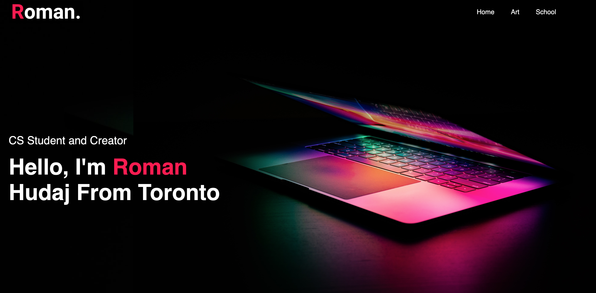

# My Personal Website

[roman-hudaj.com](http://roman-hudaj.com)

## Description

I built a Personal Website to showcase my skills, experience and cool projects. 

In the process, I gained experience with HTML, CSS & Javascript. 

## Usage
  
The site is simple and straightforward to use. Simply visit [roman-hudaj.com](http://roman-hudaj.com). There you will be on the home page shown below. After which, you can scroll and visit other pages by clicking on the menu items. 

## Credits

Tutorials I followed: 
- [Complete Responsive Personal Portfolio Website using HTML CSS & JavaScript](https://www.google.com/url?sa=t&rct=j&q=&esrc=s&source=video&cd=&cad=rja&uact=8&ved=2ahUKEwimxN7mhev9AhVsk2oFHVluCiwQtwJ6BAgIEAI&url=https%3A%2F%2Fwww.youtube.com%2Fwatch%3Fv%3Dtcskp-ncN0I&usg=AOvVaw11lxKU2qeWqbN4lyywvs4l)
- [How to Add Text Over an Image Using CSS - Tutorial](https://www.youtube.com/watch?v=hJwT1t_8_ZE)

## Features

- CSS automatically adjusts to screen sizes
- Contact form: sends name/email/message to a local google sheet on my computer 
- Downloable CV/Resume
